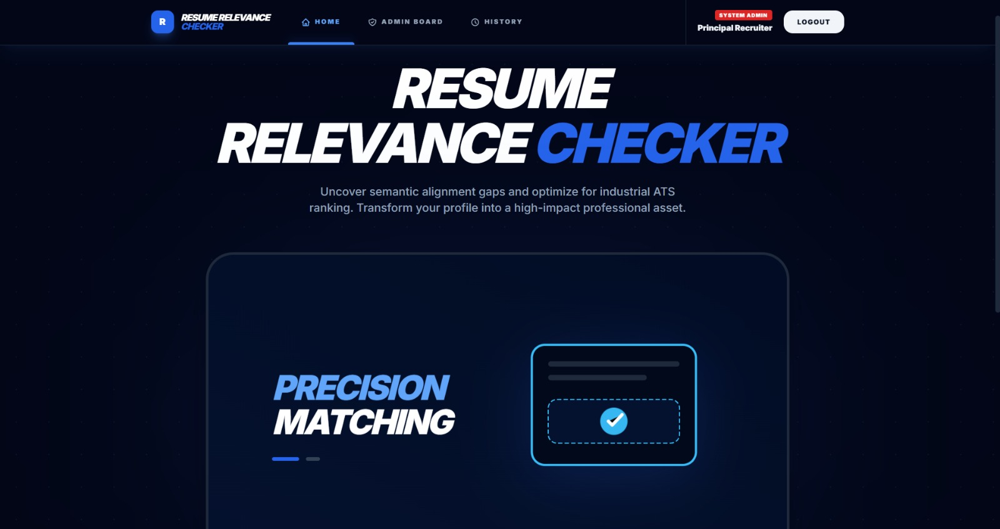
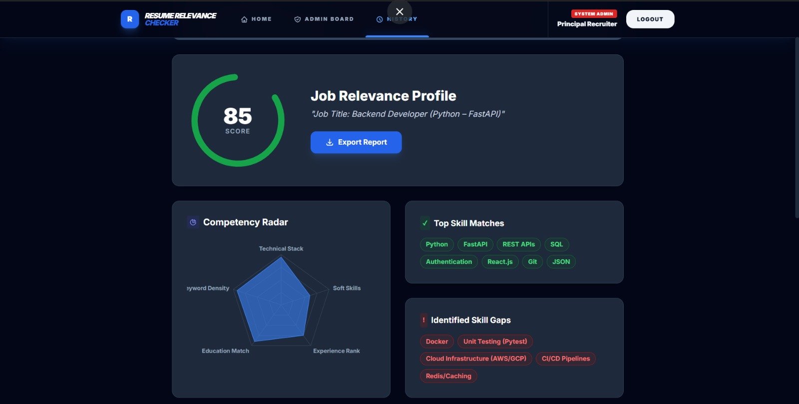

# 📄 Resume Relevance Checker

## 📌 Overview
Resume Relevance Checker is a web-based application that analyzes how well a resume matches a given Job Description (JD).  
It calculates a relevance score, highlights matched and missing keywords, and provides suggestions to improve resume alignment.Includes an Admin dashboard where recruiters can rank candidates and assign application status

This project helps candidates tailor their resumes effectively and supports recruiters by reducing manual resume screening effort.

---

## 🎯 Problem Statement
Traditional resume screening is manual, time-consuming, and prone to errors. Recruiters need to review large volumes of resumes, and candidates often struggle to understand how well their resume matches job requirements.

There is a need for a system that can:
- Compare a resume with a job description
- Calculate a relevance score
- Highlight missing skills and keywords for better alignment

---

## ✅ Objectives
- Analyze resumes and job descriptions in real-time  
- Extract and compare skills/keywords from both documents  
- Calculate a relevance score indicating resume-JD match  
- Highlight matched and missing keywords transparently  
- Suggest improvements to strengthen the resume

---

## ⚙️ Methodology / Working
1. **Input**  
   User provides a job description and uploads/pastes a resume.

2. **Preprocessing**  
   - Removes stop words and irrelevant text  
   - Tokenizes and normalizes text (lowercase conversion, special character removal)

3. **Keyword Extraction**  
   - Extracts important skills, tools, and keywords from JD  
   - Extracts related terms from resume

4. **Comparison & Scoring**  
   - Compares extracted keywords from JD and resume  
   - Computes match percentage using similarity measures (cosine similarity)

5. **Output Generation**  
   - Displays relevance score  
   - Highlights matched keywords  
   - Shows missing keywords and improvement suggestions

---

## 🚀 Features
- Upload resume (text/file)
- Paste job description
- Resume vs JD keyword matching
- ATS-style relevance score generation
- Highlights missing skills/keywords
- Suggests improvements for better resume alignment
- Secure Admin Login with validation 
- Admin can rank candidates based on resume score
- Admin can update application status (Accepted / Denied / Pending)
- User-friendly interface

---

## 🛠️ Tech Stack Used
### Frontend
- React.js
- Vite

### Backend / API
- BaaS (Backend as a Service)

### AI Integration
- Google Generative AI (Gemini)

### Programming
- Python (configuration / processing support)

---

## 📌 Future Enhancements
- Improve relevance scoring using advanced NLPy
- Add email notifications for status updates
- Add analytics dashboard for admin

---

## 👥 Team Members
This project was developed as a group project.

- Disha Goudra
- B G Megha Hebbar

---

## 📷 Screenshots

---

## ▶️ Demo Video
🎥 Demo Link: https://drive.google.com/file/d/11Ymvt8jzPOaKPK3yJ8J7XVW6y7t2lWeq/view?usp=drivesdk

---

